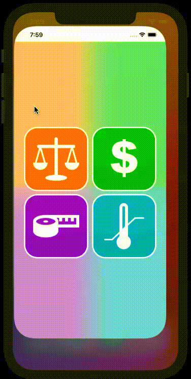

<h1>Conversor</h1

<h3>Um aplicativo para iOS, que tem como objetivo converter unidades. </h3> 
<h5>An app for iOS, who convert units.<h5>

 
<h3 align="center">Linguagem utilizada.</h3>

  

## Como rodar?
Apenas abra o project no seu xcode e clique no botão de play!

## How run?
Just open the project in xcode and click in play button!
